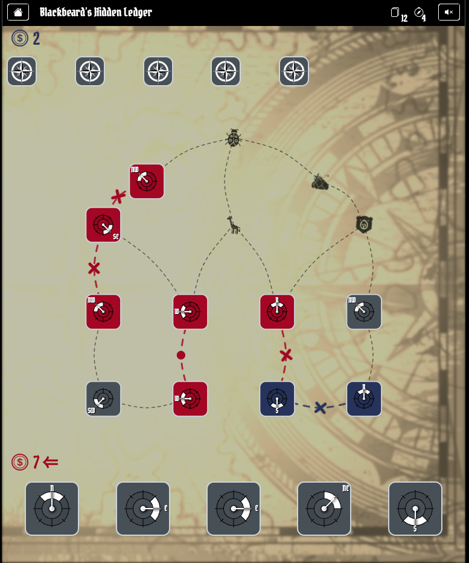

# Navigator's Gamble



Yeap. As you might think, this is yet another game development project of mine.
If you haven't done it yet, I highly recommend checking the other ones I have on GitHub:

- [Pacman](https://github.com/virgs/pacman)
- [Minesweeper AI](https://github.com/virgs/minesweeper-ai)
- [Flappy Bird AI](https://github.com/virgs/flappy-bird-ai)
- [2048 AI](https://github.com/virgs/2048-ai)
- [Rubik's Cubes AI](https://github.com/virgs/rubiks-cubes-ai)
- [Mancala](https://github.com/virgs/mancala)
- [Tetris](https://github.com/virgs/tetris)
- [Sudoku](https://github.com/virgs/sudoku)

## 🧭 How to Play (According to a Very Lost Explorer)

In [**Navigator’s Gamble**](https://virgs.github.io/navigators-gamble), you and your rivals wander through a suspiciously dangerous map — think ancient ruins, volcanic jungles, and skeletons who clearly died doing something dramatic. Your goal? Slap down directional cards to claim paths and outwit your opponents. It's basically what happens when pirates find Dijkstra's algorithm and decide to use it for evil (or fun — same thing, really).

Every move you make is just another step through a **beautifully chaotic graph**. Vertices are shiny treasure spots, and edges? Oh, those are either noble alliances or regrettable life choices.

And no, you don’t need a CS degree — but if you’ve ever looked at a node graph and thought, _“spaghetti, but make it tactical,”_ then you’re already halfway to treasure.

You’re an explorer, or a pirate, or maybe that astronomer with a questionable moral compass. Just place cards, connect paths, and pretend you know what you’re doing. It's like Dijkstra meets Uno, sprinkled with curses, volcanic lighting, and at least one guy yelling "YOU STOLE MY ROUTE."

If you've ever wanted to play cards while role-playing as a pirate-academic-strategist, _Navigator’s Gamble_ is the game for you. You're welcome.

---

## 🎨 Inspiration

Okay, cards on the table: I didn’t come up with this game entirely on my own. _Navigator’s Gamble_ is **heavily** inspired by [this Google Doodle](https://doodles.google/doodle/rise-of-the-half-moon/). It’s basically the same core mechanics — just, you know, wearing a pirate hat and shouting a lot more.

The original had loooong animations and didn’t tell me how many moon cards were in the deck. That felt unfair. My strategic soul couldn’t take it. So I fixed it. With code. And a suspicious number of navigators.

---

## 🎯 Goals

1. Study [Pure Monte Carlo Tree Search](https://en.wikipedia.org/wiki/Monte_Carlo_tree_search#Pure_Monte_Carlo_game_search) and pretend I always knew what that was.
2. Get rid of the rust and get back to [React](https://react.dev/).
3. Touch grass... I mean [HTML/CSS](#htmlcss).
4. Make up for the info the original game cruelly withheld.
5. And of course: **have fun.** 🥳 Because nothing says fun like debugging AI simulations at 2am.

---

### 📚 Studies

#### 🤖 Artificial Intelligence (a.k.a. Simulated Luck)

The game uses a **pure** Monte Carlo Tree Search to decide the AI’s next move. This means it plays out a bunch of random games in its mind-palace and picks the move that seems to win most often. Like gambling, but smarter.

As the level goes up, so do the AI’s iteration counts — and, sadly, your chances of winning go down.

##### Monte Carlo Tree Search: A Four-Step Tango

1. **Selection**: Wander through the game tree until you hit a dead end (like a good Friday night).
2. **Expansion**: Add a node for a move you haven’t tried yet.
3. **Simulation**: Play the game out randomly from that point. Total chaos. Zero regrets.
4. **Backpropagation**: Report back to all previous nodes like a good gossip courier with win/loss stats.

Do this a bunch of times. Eventually, one move will statistically look better than the rest. That's your winner.

###### Pure MCTS

The [pure version](https://en.wikipedia.org/wiki/Monte_Carlo_tree_search#Pure_Monte_Carlo_game_search) skips the fancy math (like UCB). No heuristics, just raw randomness. Surprisingly effective — like guessing on a multiple choice exam and acing it.

It works well in games with finite moves and turns — think _2048_ or any game where chaos eventually ends. Play k random games for each move and pick the best one. If they tie? Flip a coin. It’s math.

---

#### React

Confession time: I hadn’t touched React in years. Like, _“last time I used it, classes were still cool”_ kind of years.

Most of my side projects have been in Vue lately, but I figured if I’m going to build a graph-based card game in 2025, React might be the better boat to sail in. (Don't tell Vue I said that.)

And let’s be honest — React isn’t going anywhere. Might as well be friends with it again.

---

#### HTML/CSS

Here’s the thing: CSS is sorcery.

I’ve been working with the web for a while, but every time I see someone build an interactive 3D castle with three divs and a pseudo-element, I start questioning my life choices.

HTML/CSS might be simple, but mastering them? That’s a whole expedition on its own. I'm making progress — one media query at a time.

---

## Outcome

If you’ve made it this far (without switching tabs to play _Navigator’s Gamble_), thanks!

The project helped me improve a lot of skills — and honestly? That mix of building something weird, learning new things, and beating my own AI at its own game is a treasure in itself.

Which is good, because I still haven’t found that fountain of youth.

## Code It Yourself

### Project Setup

```sh
npm install
```

#### Compile and Hot-Reload for Development

```sh
npm run dev
```

#### Type-Check, Compile, and Minify for Production

```sh
npm run build
```

#### Format

```sh
npm run format
```
